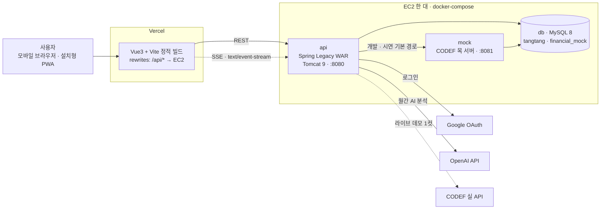
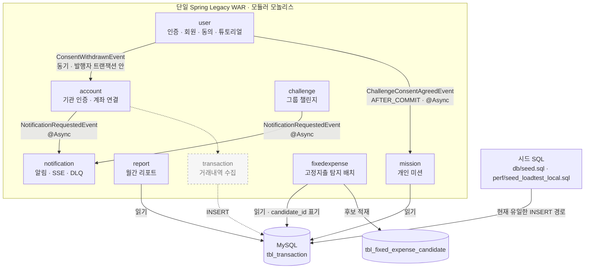
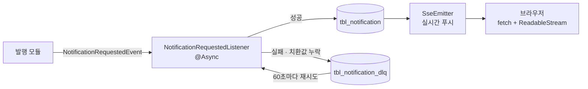

# 시스템 아키텍처 (코드 기준)

> **이 문서는 2026-08-14 기준으로 실제 코드를 읽어서 그린 것이다.** 기획 의도와 컨셉은
> `.claude/context/ARCHITECTURE.md` 에 따로 있다. 두 문서가 다르면 **이 문서가 현재 상태**다.
>
> 실선은 코드가 있는 경로, **점선과 회색은 아직 구현되지 않은 경로**다. 발표 자료에 쓸 때 이 구분을 지운다면
> "이 화살표 실제로 도나요"라는 질문에 답할 수 있는지 먼저 확인할 것.

## 1. 배포 구조



**브라우저는 Vercel 도메인 한 곳하고만 통신한다.** `/api/*` 는 Vercel 의 rewrite 가 EC2 로 넘긴다.
origin 이 하나로 통일돼 있어 인증 쿠키가 한 도메인에만 심기고, CORS 문제가 없다.

⚠ **nginx 는 쓰지 않는다.** 초기 기획 문서에 남아 있지만 `docker-compose.yml` 에 없다.
⚠ **EC2 한 대에 DB · 목 서버 · API 가 같이 떠 있다.** 부하 측정치를 해석할 때 이 사실을 반드시 감안한다
(`perf/README.md` 참고).

## 2. 애플리케이션 내부 — 모듈과 이벤트



**모듈 간 직접 호출을 최소화하고 상태 변화는 Spring Event 로 전파한다.** 브로커는 없다
(2026-07-26 Kafka 전면 제거, DECISIONS.md 참고).

### 이벤트 3종과 전달 방식

세 이벤트가 **전부 다른 방식**으로 전달된다. 편의가 아니라 각각 이유가 있다.

| 이벤트 | 발행 | 구독 | 전달 방식 | 왜 그렇게 했나 |
|---|---|---|---|---|
| `ConsentWithdrawnEvent` | `user` (동의 철회 · 탈퇴) | `account` | `@EventListener` **동기** | 동의 철회와 계좌 연동 해제가 **같은 트랜잭션에서 함께 커밋**돼야 한다. 하나만 성공하면 동의는 철회됐는데 계좌는 붙어 있는 상태가 된다 |
| `ChallengeConsentAgreedEvent` | `user` (챌린지 동의) | `mission` | `@TransactionalEventListener(AFTER_COMMIT)` + `@Async` | 동의가 **커밋된 뒤에** 미션을 배정해야 한다. 롤백된 동의로 미션이 생기면 안 된다 |
| `NotificationRequestedEvent` | `account` · `challenge` | `notification` | `@EventListener` + `@Async` | **알림이 실패해도 발행자의 작업은 성공**해야 한다. 계좌 동기화가 알림 저장을 기다릴 이유가 없다 |

알림 문구는 발행자가 아니라 `NotificationType` enum 이 소유한다. 발행자는 치환값만 넘긴다
(문구가 여러 모듈에 흩어지면 톤이 제각각이 되기 때문. 2026-08-07 팀 결정).

### 알림이 실패하면

브로커가 없으므로 재처리 장치를 직접 만들었다.



⚠ 프론트는 `EventSource` 가 아니라 **fetch + ReadableStream** 으로 SSE 를 받는다
(`apps/web/src/utils/sseStream.js`). Service Worker 를 넣는다면 `/api/` 는 손대지 말고 흘려보내야 한다.

## 3. 배치 (@Scheduled)

브로커도 배치 프레임워크도 없다. 스프링 스케줄러 6개가 전부다.

| 배치 | 주기 (기본값) | 하는 일 |
|---|---|---|
| 개인 미션 배정 | `0 10 0 * * *` (매일 00:10) | 그날의 미션을 배정한다 |
| 개인 미션 배정 복구 | `0 30 0 * * *` (매일 00:30) | 배정이 누락된 사용자를 메운다. 기동 시에도 1회 |
| 그룹 챌린지 상태 전이 | `0 1 0 * * *` (매일 00:01) | 시작일이 된 그룹을 진행 상태로 넘긴다 |
| **월간 고정지출 탐지** | `0 30 18 * * *` (매일 18:30) | 룰 기반으로 후보를 뽑아 `tbl_fixed_expense_candidate` 에 적재하고, 근거가 된 거래에 `candidate_id` 를 표기한다. 기동 시에도 1회 |
| 월간 리포트 생성 | `0 15 0 1 * *` (매월 1일 00:15) | 전월 리포트를 만든다 |
| 월간 리포트 복구 | `0 40 0 1-3 * *` (매월 1~3일 00:40) | 생성 실패분을 제한된 창에서 복구 |
| 알림 DLQ 재시도 | 60초 고정 | 실패한 알림을 다시 처리 |
| SSE 하트비트 | 15초 고정 | 프록시가 유휴 연결을 끊지 않게 |

⚠ **자정 정각(`0 0 0 * * *`)을 쓰지 않는다.** 배치 안에서 기준일을 계산하는데 정각에는 그 값이
전날로 나올 수 있어 그날 대상이 통째로 누락된다. 그래서 00:01 · 00:10 · 00:15 로 어긋나게 뒀다.

⚠ 스케줄러 전용 스레드풀(`RootConfig.taskScheduler`, poolSize 8)이 반드시 있어야 한다.
없으면 스프링이 **단일 스레드** 스케줄러로 폴백해서, 응답 없는 SSE 클라이언트 하나가
`send()` 에서 막히면 **모든 사용자의 하트비트가 멈춘다.**

## 4. 아직 코드에 없는 것 (2026-08-14 기준)

발표 전에 반드시 짚어야 하는 부분이다.

| 기능 | 상태 | 확인 방법 |
|---|---|---|
| **거래내역 수집** (CODEF/목 → `tbl_transaction`) | **미구현** | `tbl_transaction` 에 `INSERT` 하는 코드가 0곳이다. 읽거나 `UPDATE` 하는 곳만 6곳. `AccountLinkService.java:503` 주석에 "후속 이슈"로 명시돼 있다 |
| 고정지출 탐지 | ✅ **구현됨** (2026-08-14, 이슈 `#203`) | `fixedexpense` 모듈 · 매일 18:30 배치 |
| 고정지출 후보 확인·확정·제외 API | 미구현 | 이슈 `#204` |
| 절약 시뮬레이션 · 해지 검증 · 결제 예정 알림 | 미구현 | 이슈 `#205`~`#207` |

현재 거래 데이터는 **시드 SQL 로만** 들어간다. 계좌 연동은 기관 인증과 계좌 연결까지 동작하고,
그 뒤 거래내역을 긁어오는 단계가 비어 있다.

**나머지는 이미 `tbl_transaction` 을 읽어 동작한다.** 즉 수집 한 칸만 붙으면 흐름이 이어진다.

```
계좌 연동(됨) → 거래내역 수집(없음) → 고정지출 탐지(됨) → 미션 · 리포트(됨)
```

발표에서는 이 한 줄이 유용하다. "미구현"이 아니라 **"어디까지 됐고 어느 칸이 남았다"** 로 말할 수 있다.

## 5. 그 밖에 확인된 사실

- **컨텍스트가 둘로 나뉜다.** `ServletConfig` 는 `@Controller`·`@ControllerAdvice` 만, `RootConfig` 는
  그 둘을 제외한 나머지를 스캔한다. Swagger 설정을 루트에 등록하면 문서가 비어서 나온다
- **환경 설정은 한 번에 하나만 로드한다.** `APP_ENV` 로 갈린다. 두 환경 파일을 나란히 나열했다가
  로컬에서 도커 설정이 덮어써 기동이 실패한 적이 있다
- **모든 REST 응답은 `ApiResponse` 로 감싼다.** 업무 오류는 `BusinessException` → 400, 인증 실패만 401
- **Swagger 문서는 인증 없이 열린다.** 인터셉터가 `/api/**` 전용이라 `/swagger-ui.html` 은 통과한다.
  운영 노출 시 재검토가 필요하다
- ⚠ **로컬 API 가 MySQL 에 `root` 로 붙고 있다.** 초기 세팅 문서는 전용 계정 `tangtang` 을 쓰게 돼 있다.
  EC2 배포본도 같은 상태인지 확인이 필요하다
